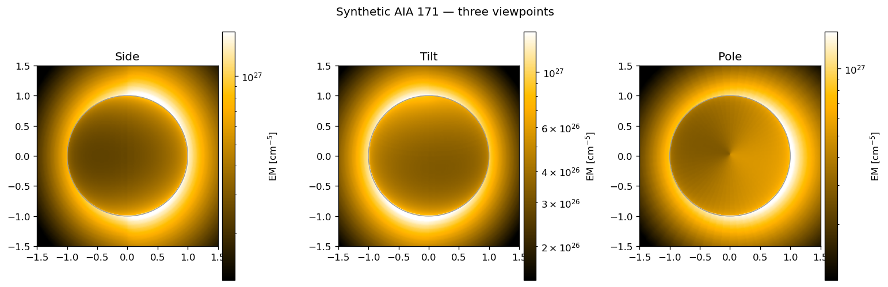
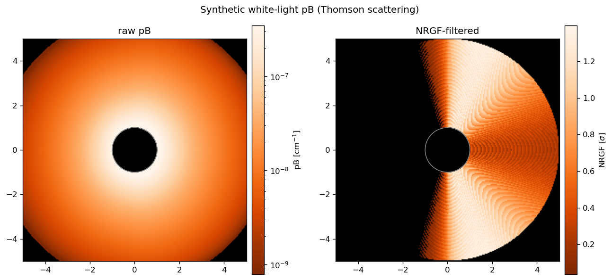
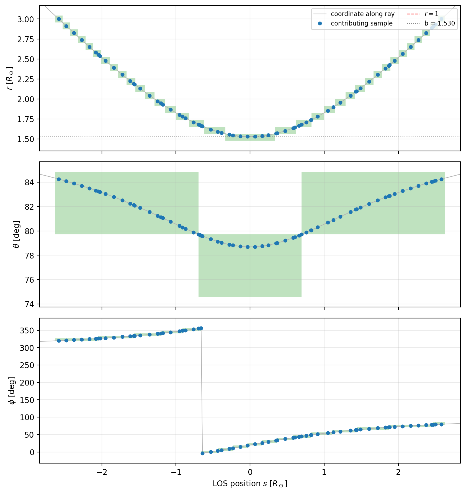

# rrt — Rectilinear Ray Tracing of MHD cubes into synthetic observables

[](https://github.com/Anshika62744/rrt/actions/workflows/ci.yml)
[](https://www.python.org/)
[](LICENSE)

Render **synthetic coronal observables** from a 3-D MHD cube. Given electron
density (and optionally temperature) on a spherical `(r, θ, φ)` grid, `rrt`
integrates along each pixel's line of sight (the analytic **Siddon** ray–cell
method) to produce:

- **EUV / SDO-AIA** maps — `I_λ = ∫ nₑ² R_λ(T) dℓ`
- **White-light pB** — Thomson scattering (van de Hulst / Billings), optional NRGF
- **Line-of-sight diagnostics** — walk one ray and verify the algorithm

Works on any domain (wedge, polar cap, full shell, full disk) and both file
layouts (ARMS and MAS/PSI) — all auto-detected.

| EUV — three views | White light — pB + NRGF | LOS voxel proof |
|:---:|:---:|:---:|
|  |  |  |

## Install

```bash
conda env create -f environment.yml && conda activate rrt   # brings numba/h5py/sunpy
# or:  python -m venv .venv && source .venv/bin/activate && pip install -e ".[test]"
```

Numba JIT-compiles on the first call (~5–10 s), then runs at native speed.

## Run it (no data needed)

```bash
python examples/generate_synthetic_data.py          # writes small cubes to examples/data/
rrt-euv examples/configs/euv_fulldisk_synth.yaml    # → out/…/*.png
rrt-wl  examples/configs/wl_fulldisk_synth.yaml
rrt-los examples/configs/los_fulldisk_synth.yaml
```

Reproduce an EUV map, a WL map, and an LOS diagnostic — for a **wedge** and a
**full disk** — by editing one YAML file in [`examples/configs/`](examples/configs/).

Or in Python:

```python
import numpy as np
from rrt import synthdata
from rrt.observer import make_observer, image_grid
from rrt.euv import run_siddon
from rrt.response import FLAT_T, FLAT_R

c = synthdata.make_cube("full", "density_only", nr=24, nth=48, nph=64, r_range=(1.0, 3.0))
T = np.full_like(c["ne"], 1.0e6)
_, e_los, x_img, y_img = make_observer(phi_obs_deg=-70, B0_deg=0)
Xg, Yg, _ = image_grid(rmax=1.5, npix=256)
EM = run_siddon(Xg, Yg, x_img, y_img, e_los, c["r"], c["theta"], c["phi"],
                c["ne"], T, FLAT_T, FLAT_R, Npix=256, Rmax=1.5)
```

## Your own data

One loader, `rrt.io.load_mhd`, auto-detects the input case, file format, ghost
cells, units, axis order and angle units (each override-able):

```python
from rrt.io import load_mhd
cube = load_mhd("rho.h5")                              # density-only → isothermal
cube = load_mhd("rho.h5", temperature="t.h5",          # separate MAS files
                fmt="mas", ne_scale=1e8, t_scale=2.807e7, r_range=(1.03, 5.0))
cube = load_mhd("both.h5", temperature="vars/T")       # single file
print(cube.summary())
```

For Carrington-framed data (MAS/PSI) you can set the observer from an observation
time instead of angles — in a config: `- {label: sub-Earth, obs_time: '2024-05-08T14:09:00'}`.

See [`docs/DATA_FORMAT.md`](docs/DATA_FORMAT.md) for the HDF5 spec,
[`docs/API.md`](docs/API.md) for the API, and [`docs/THEORY.md`](docs/THEORY.md)
for the method.

## Test

```bash
pytest        # runs entirely on generated synthetic data
```

## License

[MIT](LICENSE) © Anshika Singh. If you use this, please cite it (`CITATION.cff`).
